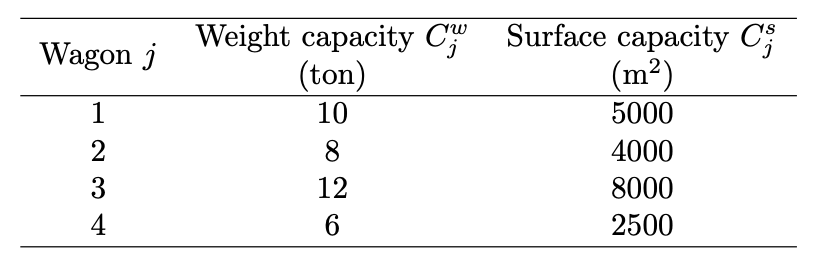
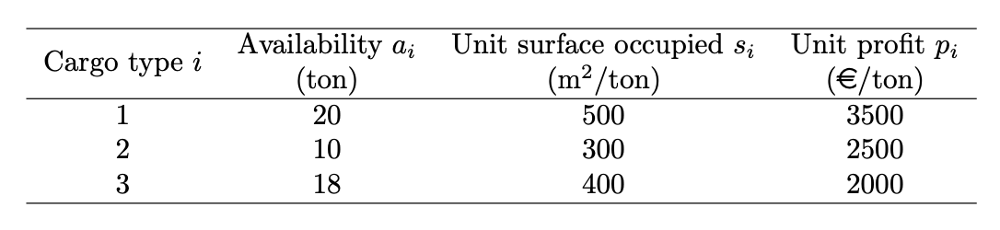

```{r setup, include=FALSE}
knitr::opts_chunk$set(echo = TRUE)
```

# Exercise 1

##Answer the following questions:

####1. Can an LP model have more than one optimal solution? Is it possible for an LP model to have exactly two optimal solutions? Why or why not?

Yes, an LP problem can have more than one optimal solution. This could happen when the objective function is parallel to one of the problem constraints that defines on the edge (or face, in higher dimensions) of the feasible region. In this case, the entire segment of feasible points along that edge yields the same optimal value and might be an optimal solution.
However, an LP problem can NOT have two exact optimal solutions. This is because the set of optimal solutions (feasible region) in linear programming is always convex. If two points $x_1$ and $x_2$ are both optimal, then every convex combination of these two points (that is, any point of the form $\lambda x_1 + (1- \lambda)x_2$, where $0 \le \lambda \le 1$) is also optimal.
Therefore, between any two optimal solutions, there are infinitely many other optimal solutions.

####2. Are the following objective functions for an LP model equivalent?

$$\text{max} (2x_1 + 3x_2 −x_3) \\ \text{min}(−2x_1 −3x_2 +x_3)$$

Yes, the two objective functions are equivalent, because maximizing a linear function is equivalent to minimizing its negative.
If both objective functions are applied to the same set of constraints, they will lead to the same optimal values for the decision variables $x_1,x_2,x_3$. 
The only difference will be the objective function value, which will have opposite signs. 
So yes, both formulations will produce identical optimal solutions, even though the objective values will be numerically opposite.

#### Which of the following constraints are not linear or cannot be included as a constraint in a linear programming problem?

The constraints that are not linear and therefore cannot be included in an LP problem are:

- $2x_1 + \sqrt x_2 \ge 60$ because it contains a square root, which is a non-linear function.
- $\frac{3x_1+2x_2x_1-3x_3}{x_1+x_2+x_3} \le 0.9$ because it contains a product of variables and at least a variable in the denominator, both of which make it non-linear.
- $3x_1^2+7x_2 \le 45$ because it contains a quadratic term $x1^2$, which is not linear.

Only the constraints $2x_1+x_2-3x_3 \ge 50$ and $4x_1- \frac{1}{2}x_2=75$.

# Exercise 2

A construction materials company is looking for a way to maximize profit for transportation of their goods. The company has a train available with 4 wagons. The weight and surface capacities of each wagon are shown in the following table:



When stocking the wagons, the company can choose among 3 types of cargo, each with its own specifications, as shown in the following table:



The company has to decide how many tons of each cargo type should be loaded on train wagons in order to maximize profit.

1. Define the decision variables for the problem described above. 
2. Define the objective function for the problem described above. 
3. Define the constraints for the problem described above.
4. Write and solve the model with AMPL.

**Solution**

####1. Define the decision variables for the problem described above.

Let

$$x_{ij} $\text{number of tons of cargo type i loaded into type j wagon}$$

For $i={1,2,3}$ and $j=1,2,3,4$.

The decision variables are the combination of cargo types and wagons:

- $x_{11}$
- $x_{12}$
- $x_{13}$
- $x_{14}$
- $x_{21}$
- $x_{22}$
- $x_{23}$
- $x_{24}$
- $x_{31}$
- $x_{32}$
- $x_{33}$
- $x_{34}$

####2. Define the objective function for the problem described above.

In order to maximize the total profit, which depends on how many tons of cargo are loaded into each wagon. Let:

- $p_1=3500 €/\text{ton (cargo type 1)}$
- $p_2=2500 €/\text{ton (cargo type 2)}$
- $p_3=2000 €/\text{ton (cargo type 3)}$

If the tons of cargo must be split between the four wagons $j$, then the objective function is:

$$\text{Maximize Z} =\sum_{i=1}^3\sum_{j=1}^4 p_ix_{ij}= 3500(x_{11}+x_{12}+x_{13}+x_{14}) + 2500(x_{21}+x_{22}+x_{23}+x_{24}) +
2000(x_{31}+x_{32}+x_{33}+x_{34}$$

####3. Define the constraints for the problem descripted above

**1. Weigh capacity constraint**

For each wagon $j=1,2,3,4$, the total weight loaded cannot exceed its capacity $C_j^w$:

$$\sum_{i=1}^3x_{ij} \le C_l^w \quad \text{for} \quad j=1,2,3,4$$

The weight capacity constraints are:

$$
x_{11}+x_{21}+x_{31} \le 10 \quad \text{(wagon 1)}\\
x_{12}+x_{22}+x_{32} \le 8 \quad \text{(wagon 2)} \\
x_{13}+x_{23}+x_{33}\le 12 \quad \text{(wagon 3)}\\
x_{14}+x_{24}+x_{34}\le 6 \quad \text{(wagon 4)}
$$

**2. Surface capacity constraints**

Each cargo type occupies a specific surface per ton. The total surface occupied on each wagon cannot exceed its surface capacity $C_j^s$:

$$\sum_{i=1}^3s_ix_{ij} \le C_j^s \quad \text{for} \quad j=1,2,3,4$$

Given the unit surfaces $s_1=500$, $s_2=300$ and $s_3=400$, the surface capacity constraints are:

$$
500x_{11}+300x_{21}+400x_{31} \le 5000\\
500x_{12}+300x_{22}+400x_{32} \le 4000\\
500x_{13}+300x_{23}+400x_{33}\le 8000\\
500x_{14}+300x_{24}+400x_{34}\le 2500
$$

**3.Availability constraints**

Each cargo type $i$ has a limited availability $a_i$, so the total amount loaded across all wagons cannot exceed it:
